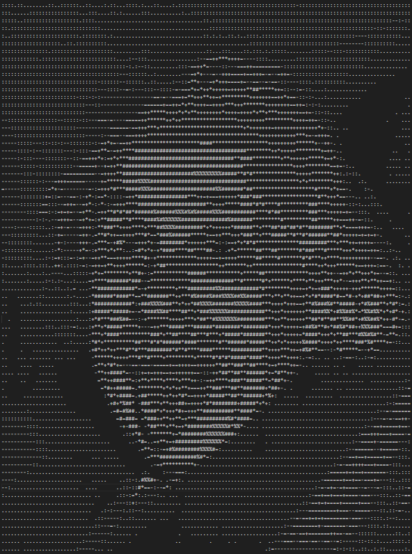

# Image to ASCII art.

A web-based tool that convert images into ASCII art directly in your browser.

## Try it

Want to try it yourself ? 
[**DEMO**](https://reaue.github.io/ImgToASCII/)

## Features

- Convert images into ASCII art.
- Adjustable ASCII resolution.
- Choose between full-color or black and white rendering.
- copy directly to cliboard or export as a png image with in one click.

## Proof of concept

The algorithm was first developed in python as a proof of concept, you can find it in `poc/main.py`.

## How it works

The main idea is that this following string : `.:-=+*#%@"` contains all level of brightness and moreover you can easily find brightness from RGB values with this formula : `0.2126 * red + 0.7152 * green + 0.0722 * blue`, because human eye has a different sensitivity to red, green and blue.